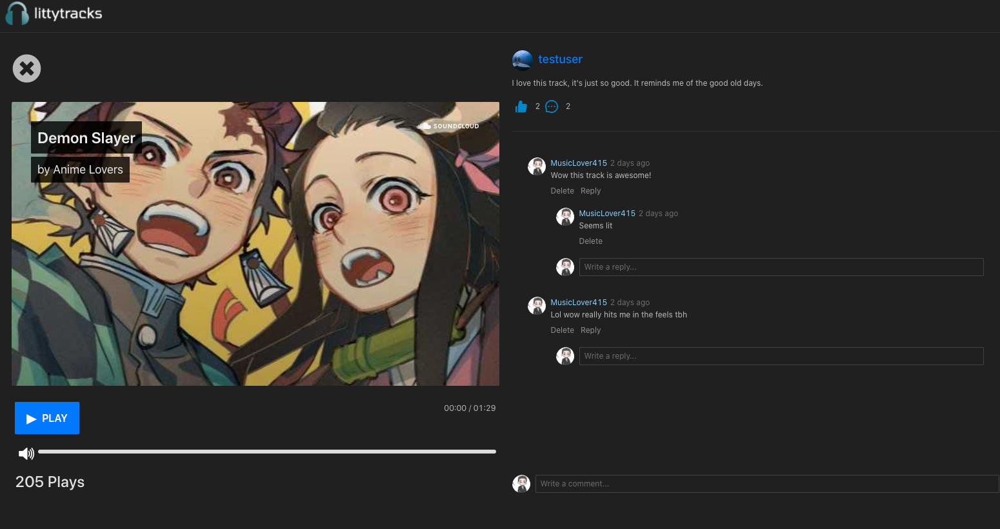

#  &nbsp; littytracks

 

[littytracks](https://littytracks.herokuapp.com/) is a music sharing application built with Django/GraphQL & React/TypeScript/AntDesign

## Technologies
- GraphQL
- Javascript
- Django
- AntDesign
- Cloudinary API
- react-sound-player

## Roadmap
1. Deploy backend and frontend 
2. Website and App Create Track 
3. Website and App Rate Track 
4. Website and App User session auth 

## Current Features
- Upload Tracks
- Like/Dislike Tracks
- Comment Tracks
- Play Tracks
- Create Account
- Search Tracks

## Future Features
- Share Music
- Make Playlist
- Unlimited scrolling for comments
- Follow Other Users
- Global Music Player
